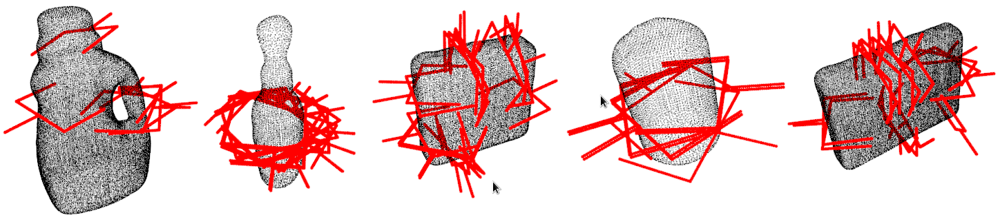

# grasp_candidates_generator 
## (part of agile_grasp 2.0) 

* **Author:** Andreas ten Pas (atp@ccs.neu.edu)
* **Version:** 1.0.0
* **Author's website:** [http://www.ccs.neu.edu/home/atp/](http://www.ccs.neu.edu/home/atp/)
* **License: BSD


## 1) Overview

This package generates grasp candidates for 3D point clouds. AGILE stands for **A**ntipodal **G**rasp **I**dentification and 
**LE**arning. The reference for this package is: 
[High precision grasp pose detection in dense clutter](http://arxiv.org/abs/1603.01564). *agile_grasp 2.0* is an improved 
version of our previous package, [agile_grasp](http://wiki.ros.org/agile_grasp).



This part of the package creates grasp candidates and can check if they are antipodal using geometric conditions. Please 
notice that **no** machine learning is included in this part.


## 2) Requirements

1. [PCL 1.7 or later](http://pointclouds.org/)
2. [Eigen 3.0 or later](https://eigen.tuxfamily.org)


## 3) Compilation

1. Clone the grasp_candidates_generator repository into some folder: 

   ```
   $ cd <location_of_your_workspace>
   $ git clone https://atenpas@bitbucket.org/atenpas/grasp_candidates_generator.git
   ```

2. Delete the *build* folder and rebuild the project: 

   ```
   $ cd grasp_candidates_generator
   $ rm -rf build && mkdir build && cd build
   $ cmake ..
   $ make
   ```


## 4) Generate Grasp Candidates for a Point Cloud File

Run the following from within the *build* folder:

   ```
   $ ./generate_candidates ../cfg/params.cfg ~/data/some_cloud.pcd
   ```


## 5) Parameters

Brief explanations of parameters are given in *cfg/params.cfg*.


## 6) Citation

If you like this package and use it in your own work, please cite our [arXiv paper](http://arxiv.org/abs/1603.01564):

```
@misc{1603.01564,
Author = {Marcus Gualtieri and Andreas ten Pas and Kate Saenko and Robert Platt},
Title = {High precision grasp pose detection in dense clutter},
Year = {2016},
Eprint = {arXiv:1603.01564},
} 
```
